# 🛡️ STRIDE + PASTA THREAT MODELS
## Ultimate Arbitrage System - Comprehensive Security Analysis

### 🎯 EXECUTIVE SUMMARY
This document provides comprehensive threat modeling using both STRIDE (Spoofing, Tampering, Repudiation, Information Disclosure, Denial of Service, Elevation of Privilege) and PASTA (Process for Attack Simulation and Threat Analysis) methodologies. Every attack vector is analyzed with gray-hat perspective to identify vulnerabilities before adversaries do.

---

## 🏗️ SYSTEM ARCHITECTURE ANALYSIS

### 🌐 DATA FLOW DIAGRAM - Level 0 (Context)


### 🔍 DATA FLOW DIAGRAM - Level 1 (System Detail)

```mermaid
flowchart TB
    subgraph Frontend["🖥️ Frontend Layer"]
        WebApp["React Dashboard"]
        MobileApp["📱 Mobile App"]
        API_Client["🔌 API Clients"]
    end
    
    subgraph Security["🔐 Security Layer"]
        WAF["🛡️ Web Application Firewall"]
        AuthSrv["🔑 Authentication Service"]
        AuthzSrv["🚪 Authorization Service"]
        RateLimiter["⏱️ Rate Limiter"]
    end
    
    subgraph API_Layer["⚡ API Layer"]
        LoadBalancer["⚖️ Load Balancer"]
        APIGateway["🚪 API Gateway"]
        Validation["✅ Input Validation"]
        Logging["📝 Security Logging"]
    end
    
    subgraph Business["💼 Business Logic"]
        UserMgmt["👥 User Management"]
        TradeMgmt["💱 Trade Management"]
        RiskEngine["⚠️ Risk Engine"]
        ComplianceEngine["📋 Compliance Engine"]
    end
    
    subgraph AI_Layer["🧠 AI/ML Layer"]
        ModelServer["🤖 Model Server"]
        DataPipeline["🔄 Data Pipeline"]
        FeatureStore["📊 Feature Store"]
        ModelRegistry["📚 Model Registry"]
    end
    
    subgraph Quantum["⚛️ Quantum Layer"]
        QuantumSim["🔬 Quantum Simulator"]
        QOptimizer["📐 Quantum Optimizer"]
        QSecurity["🔒 Quantum Security"]
    end
    
    subgraph Data["💾 Data Layer"]
        UserDB["👤 User Database"]
        MarketDB["📈 Market Data DB"]
        TradeDB["💱 Trade Database"]
        LogDB["📝 Audit Log DB"]
        Cache["⚡ Redis Cache"]
        Encryption["🔐 Encryption Service"]
    end
    
    subgraph External_APIs["🌐 External APIs"]
        ExchangeAPIs["🏦 Exchange APIs"]
        DataFeeds["📊 Data Feeds"]
        PaymentGWs["💳 Payment Gateways"]
        RegReporting["🏛️ Regulatory Reporting"]
    end
    
    Frontend --> Security
    Security --> API_Layer
    API_Layer --> Business
    Business --> AI_Layer
    Business --> Quantum
    AI_Layer --> Data
    Quantum --> Data
    Business --> External_APIs
```



---

## 🎭 STRIDE THREAT ANALYSIS

### 💀 S - SPOOFING THREATS

#### 🎯 **S1: Identity Spoofing**
| **Threat** | **Description** | **Attack Vector** | **Impact** | **Likelihood** | **Risk Level** |
|-----------|----------------|------------------|-----------|---------------|---------------|
| **User Identity Spoofing** | Attacker impersonates legitimate user | Stolen credentials, session hijacking | HIGH | MEDIUM | HIGH |
| **Exchange API Spoofing** | Fake exchange responses | Man-in-the-middle attacks | VERY HIGH | LOW | MEDIUM |
| **Market Data Spoofing** | Manipulated price feeds | Compromised data providers | VERY HIGH | MEDIUM | HIGH |
| **AI Model Spoofing** | Malicious model replacement | Supply chain attacks | VERY HIGH | LOW | MEDIUM |
| **Quantum Signal Spoofing** | Fake quantum computations | Hardware tampering | HIGH | VERY LOW | LOW |

#### 🛡️ **Spoofing Mitigations**
- **Multi-factor Authentication**: Hardware tokens, biometrics
- **Certificate Pinning**: Prevent MITM attacks
- **Data Source Verification**: Multiple feed validation
- **Model Signing**: Cryptographic model verification
- **Quantum Authentication**: Quantum-resistant protocols

### 🔧 T - TAMPERING THREATS

#### 🎯 **T1: Data Tampering**
| **Threat** | **Description** | **Attack Vector** | **Impact** | **Likelihood** | **Risk Level** |
|-----------|----------------|------------------|-----------|---------------|---------------|
| **Trade Order Tampering** | Modified trading instructions | API parameter manipulation | VERY HIGH | MEDIUM | HIGH |
| **Price Data Tampering** | Altered market prices | Database injection | VERY HIGH | LOW | MEDIUM |
| **Risk Parameter Tampering** | Modified risk thresholds | Privilege escalation | VERY HIGH | MEDIUM | HIGH |
| **AI Model Tampering** | Poisoned training data | Data injection attacks | HIGH | MEDIUM | MEDIUM |
| **Configuration Tampering** | Modified system settings | Insider threats | HIGH | HIGH | HIGH |

#### 🛡️ **Tampering Mitigations**
- **Data Integrity Checks**: Cryptographic hashes
- **Input Validation**: Strict parameter checking
- **Database Constraints**: Referential integrity
- **Model Validation**: Adversarial testing
- **Configuration Management**: Immutable infrastructure

### 🚫 R - REPUDIATION THREATS

#### 🎯 **R1: Non-Repudiation Failures**
| **Threat** | **Description** | **Attack Vector** | **Impact** | **Likelihood** | **Risk Level** |
|-----------|----------------|------------------|-----------|---------------|---------------|
| **Trade Denial** | User denies making trades | Insufficient audit trails | HIGH | HIGH | HIGH |
| **Transaction Disputes** | Disputed trade executions | Weak logging mechanisms | MEDIUM | HIGH | MEDIUM |
| **Regulatory Violations** | Denied compliance failures | Missing evidence | VERY HIGH | MEDIUM | HIGH |
| **System Action Denial** | Denied automated actions | Insufficient attribution | MEDIUM | MEDIUM | LOW |
| **Data Access Denial** | Denied unauthorized access | Poor access logging | HIGH | HIGH | HIGH |

#### 🛡️ **Repudiation Mitigations**
- **Comprehensive Audit Logging**: All actions logged
- **Digital Signatures**: Non-repudiable transactions
- **Blockchain Timestamping**: Immutable records
- **Video Surveillance**: Physical access monitoring
- **Legal Frameworks**: Clear terms and conditions

### 📊 I - INFORMATION DISCLOSURE THREATS

#### 🎯 **I1: Data Leakage**
| **Threat** | **Description** | **Attack Vector** | **Impact** | **Likelihood** | **Risk Level** |
|-----------|----------------|------------------|-----------|---------------|---------------|
| **Customer PII Exposure** | Personal data leakage | Database breaches | VERY HIGH | MEDIUM | HIGH |
| **Trading Strategy Disclosure** | Proprietary algorithms exposed | Insider threats, hacking | VERY HIGH | MEDIUM | HIGH |
| **Financial Data Exposure** | P&L and position data leaked | API vulnerabilities | HIGH | MEDIUM | MEDIUM |
| **Quantum Algorithm Theft** | Proprietary quantum code stolen | Industrial espionage | VERY HIGH | LOW | MEDIUM |
| **Market Intelligence Leaks** | Competitive advantage lost | Social engineering | HIGH | HIGH | HIGH |

#### 🛡️ **Information Disclosure Mitigations**
- **Data Classification**: Sensitivity labeling
- **Encryption at Rest**: AES-256 encryption
- **Encryption in Transit**: TLS 1.3 minimum
- **Access Controls**: Need-to-know basis
- **Data Loss Prevention**: DLP solutions

### 🚫 D - DENIAL OF SERVICE THREATS

#### 🎯 **D1: Service Disruption**
| **Threat** | **Description** | **Attack Vector** | **Impact** | **Likelihood** | **Risk Level** |
|-----------|----------------|------------------|-----------|---------------|---------------|
| **DDoS Attacks** | Service unavailability | Botnet attacks | HIGH | HIGH | HIGH |
| **Resource Exhaustion** | System overload | Algorithmic complexity attacks | HIGH | MEDIUM | MEDIUM |
| **Database Locking** | Transaction deadlocks | SQL injection | MEDIUM | LOW | LOW |
| **AI Model Poisoning** | Performance degradation | Adversarial inputs | HIGH | MEDIUM | MEDIUM |
| **Quantum Interference** | Computation disruption | Electromagnetic attacks | MEDIUM | VERY LOW | LOW |

#### 🛡️ **Denial of Service Mitigations**
- **DDoS Protection**: CDN and WAF
- **Rate Limiting**: API throttling
- **Resource Monitoring**: Capacity management
- **Circuit Breakers**: Failure isolation
- **Quantum Shielding**: EMI protection

### 👑 E - ELEVATION OF PRIVILEGE THREATS

#### 🎯 **E1: Unauthorized Access**
| **Threat** | **Description** | **Attack Vector** | **Impact** | **Likelihood** | **Risk Level** |
|-----------|----------------|------------------|-----------|---------------|---------------|
| **Admin Privilege Escalation** | Gain administrative access | Vulnerability exploitation | VERY HIGH | MEDIUM | HIGH |
| **Database Privilege Abuse** | Unauthorized data access | SQL injection | HIGH | LOW | MEDIUM |
| **API Privilege Escalation** | Access restricted endpoints | JWT manipulation | HIGH | MEDIUM | MEDIUM |
| **Container Escape** | Break out of containers | Kernel exploits | HIGH | LOW | MEDIUM |
| **Quantum Key Compromise** | Access quantum secrets | Side-channel attacks | VERY HIGH | VERY LOW | LOW |

#### 🛡️ **Elevation of Privilege Mitigations**
- **Principle of Least Privilege**: Minimal access rights
- **Regular Security Audits**: Vulnerability assessments
- **Container Security**: Hardened images
- **Privilege Monitoring**: Unusual activity detection
- **Quantum Key Management**: Hardware security modules

---

## 🍝 PASTA THREAT ANALYSIS

### 📋 **Stage 1: Define Objectives**

#### 🎯 **Business Objectives**
- Maximize profit generation with zero capital investment
- Maintain 99.99% system availability
- Ensure regulatory compliance across all jurisdictions
- Protect intellectual property and competitive advantages
- Preserve customer trust and reputation

#### 🛡️ **Security Objectives**
- Prevent unauthorized access to trading systems
- Protect customer personal and financial data
- Ensure data integrity for all trading operations
- Maintain audit trails for regulatory compliance
- Prevent market manipulation and insider trading

### 📊 **Stage 2: Define Technical Scope**

#### 🏗️ **In-Scope Components**
| **Component** | **Criticality** | **Data Sensitivity** | **External Exposure** | **Attack Surface** |
|--------------|---------------|-------------------|---------------------|-------------------|
| **Web Dashboard** | HIGH | MEDIUM | HIGH | HIGH |
| **API Gateway** | CRITICAL | HIGH | HIGH | VERY HIGH |
| **AI/ML Engine** | CRITICAL | VERY HIGH | LOW | MEDIUM |
| **Quantum Optimizer** | CRITICAL | VERY HIGH | NONE | LOW |
| **Trading Engine** | CRITICAL | VERY HIGH | MEDIUM | MEDIUM |
| **Risk Manager** | CRITICAL | HIGH | LOW | LOW |
| **Database Systems** | CRITICAL | VERY HIGH | NONE | MEDIUM |
| **External APIs** | HIGH | MEDIUM | VERY HIGH | VERY HIGH |

### 🎭 **Stage 3: Application Decomposition**

#### 🔍 **Trust Boundaries**

```mermaid
flowchart LR
    subgraph Internet["🌐 Internet (Untrusted)"]
        PublicUsers["👥 Public Users"]
        Attackers["💀 Threat Actors"]
    end
    
    subgraph DMZ["🚧 DMZ (Low Trust)"]
        WAF["🛡️ Web Application Firewall"]
        LoadBalancer["⚖️ Load Balancer"]
    end
    
    subgraph AppTier["🖥️ Application Tier (Medium Trust)"]
        WebServers["🌐 Web Servers"]
        APIGateway["🚪 API Gateway"]
    end
    
    subgraph BusinessTier["💼 Business Tier (High Trust)"]
        TradingEngine["💱 Trading Engine"]
        AIEngine["🧠 AI Engine"]
        RiskManager["🛡️ Risk Manager"]
    end
    
    subgraph DataTier["💾 Data Tier (Very High Trust)"]
        Database["🗄️ Databases"]
        QuantumSystems["⚛️ Quantum Systems"]
    end
    
    subgraph SecureTier["🔒 Secure Tier (Maximum Trust)"]
        HSM["🔐 Hardware Security Module"]
        KeyManagement["🗝️ Key Management"]
    end
    
    Internet -.->|HTTPS| DMZ
    DMZ -.->|Filtered| AppTier
    AppTier -.->|Authenticated| BusinessTier
    BusinessTier -.->|Encrypted| DataTier
    DataTier -.->|Secured| SecureTier
```


### 🕵️ **Stage 4: Threat Analysis**

#### 💀 **Threat Actors**
| **Actor Type** | **Motivation** | **Capability** | **Resources** | **Threat Level** |
|---------------|---------------|---------------|---------------|------------------|
| **Cyber Criminals** | Financial gain | HIGH | MEDIUM | HIGH |
| **Nation-State APT** | Economic espionage | VERY HIGH | VERY HIGH | VERY HIGH |
| **Insider Threats** | Personal gain | MEDIUM | HIGH | HIGH |
| **Competitors** | Competitive advantage | HIGH | HIGH | HIGH |
| **Hacktivists** | Ideological | MEDIUM | LOW | MEDIUM |
| **Market Manipulators** | Trading advantage | HIGH | VERY HIGH | VERY HIGH |

#### 🎯 **Attack Scenarios**

##### **Scenario 1: Market Manipulation Bot Attack**

```mermaid
sequenceDiagram
    participant Attacker as 💀 Attacker
    participant API as 🚪 API Gateway
    participant Trading as 💱 Trading Engine
    participant Exchange as 🏦 Exchange
    participant Market as 📊 Market
    
    Attacker->>API: 1. Create fake accounts
    API->>Trading: 2. High-frequency orders
    Trading->>Exchange: 3. Coordinated trades
    Exchange->>Market: 4. Price manipulation
    Market->>Trading: 5. Artificial arbitrage opportunities
    Trading->>Attacker: 6. Exploit fake opportunities
    
    Note over Attacker,Market: Attack exploits system's speed for manipulation
```


##### **Scenario 2: AI Model Poisoning Attack**

```mermaid
sequenceDiagram
    participant Attacker as 💀 Attacker
    participant DataFeed as 📊 Data Feed
    participant AI as 🧠 AI Engine
    participant Trading as 💱 Trading Engine
    participant Victim as 👤 Victim
    
    Attacker->>DataFeed: 1. Inject malicious data
    DataFeed->>AI: 2. Poisoned training data
    AI->>AI: 3. Model degradation
    AI->>Trading: 4. Poor predictions
    Trading->>Victim: 5. Losses
    
    Note over Attacker,Victim: Subtle long-term attack on AI reliability
```


### 🔬 **Stage 5: Vulnerability Analysis**

#### 🚨 **Critical Vulnerabilities**
| **Component** | **Vulnerability** | **CVSS Score** | **Exploitability** | **Impact** |
|--------------|------------------|---------------|------------------|------------|
| **API Gateway** | Authentication bypass | 9.8 | HIGH | CRITICAL |
| **Trading Engine** | Race condition | 8.5 | MEDIUM | HIGH |
| **AI Engine** | Model inversion | 7.2 | MEDIUM | HIGH |
| **Database** | SQL injection | 9.1 | HIGH | CRITICAL |
| **Quantum System** | Side-channel leakage | 6.8 | LOW | MEDIUM |

### ⚔️ **Stage 6: Attack Modeling**

#### 🗂️ **Attack Trees**

##### **Goal: Steal Trading Strategies**
```
🎯 Steal Trading Strategies
├── 💻 Technical Attack
│   ├── 🔓 Direct System Access
│   │   ├── 🔑 Credential Theft
│   │   │   ├── 🎣 Phishing
│   │   │   ├── 🔐 Brute Force
│   │   │   └── 💾 Credential Stuffing
│   │   ├── 🚪 Privilege Escalation
│   │   │   ├── 🐛 Software Vulnerabilities
│   │   │   ├── ⚙️ Misconfigurations
│   │   │   └── 👤 Insider Access
│   │   └── 🔍 Data Exfiltration
│   │       ├── 📁 File System Access
│   │       ├── 🗄️ Database Queries
│   │       └── 📡 Network Interception
│   └── 🕷️ Indirect Access
│       ├── 🎯 Supply Chain Attack
│       ├── 🔗 Third-Party Compromise
│       └── 📱 Social Engineering
└── 👤 Human Attack
    ├── 💰 Bribery/Corruption
    ├── 🔧 Insider Threat
    └── 🎭 Social Engineering
```

### 🛡️ **Stage 7: Risk Analysis**

#### 📊 **Risk Heat Map**
| **Risk Level** | **Probability** | **Impact** | **Examples** |
|---------------|----------------|-----------|-------------|
| **🔴 CRITICAL** | HIGH | VERY HIGH | Market manipulation, Data breach |
| **🟠 HIGH** | MEDIUM | HIGH | Service disruption, Algorithm theft |
| **🟡 MEDIUM** | LOW | MEDIUM | Performance degradation, Minor data leak |
| **🟢 LOW** | VERY LOW | LOW | Cosmetic issues, Non-critical errors |

---

## 🔍 ABUSE CASES

### 💀 **Abuse Case 1: Flash Crash Manipulation**

#### 📋 **Scenario**
**Primary Actor**: Market Manipulator Bot Network  
**Goal**: Trigger artificial flash crash to profit from recovery  
**Preconditions**: Access to multiple exchange APIs  

#### 🎭 **Attack Flow**
1. **📊 Market Analysis**: Identify low-liquidity periods
2. **🤖 Bot Deployment**: Deploy coordinated selling bots
3. **💥 Flash Crash**: Execute massive coordinated sell orders
4. **⚡ System Response**: UAS detects "arbitrage opportunity"
5. **🎯 Exploitation**: System buys at artificially low prices
6. **💰 Profit**: Manipulator profits from price recovery

#### 🛡️ **Mitigations**
- **📊 Anomaly Detection**: AI-powered market manipulation detection
- **⏱️ Circuit Breakers**: Automatic trading halts during volatility
- **📈 Liquidity Analysis**: Real-time liquidity assessment
- **🔍 Pattern Recognition**: Coordinated attack detection

### 💀 **Abuse Case 2: Quantum Algorithm Theft**

#### 📋 **Scenario**
**Primary Actor**: Nation-State APT Group  
**Goal**: Steal proprietary quantum optimization algorithms  
**Preconditions**: Advanced persistent threat capabilities  

#### 🎭 **Attack Flow**
1. **🎣 Spear Phishing**: Target quantum research team
2. **🔓 Initial Access**: Compromise development environment
3. **📊 Reconnaissance**: Map quantum system architecture
4. **⬆️ Privilege Escalation**: Gain administrative access
5. **🔍 Data Exfiltration**: Extract quantum algorithms
6. **🏃 Persistence**: Maintain long-term access

#### 🛡️ **Mitigations**
- **🎓 Security Awareness**: Quantum team training
- **🔐 Code Encryption**: Encrypted algorithm storage
- **🚪 Access Controls**: Multi-factor authentication
- **📝 Activity Monitoring**: Behavioral analytics

### 💀 **Abuse Case 3: Regulatory Evasion**

#### 📋 **Scenario**
**Primary Actor**: Unscrupulous Trader  
**Goal**: Evade regulatory reporting requirements  
**Preconditions**: System administrator access  

#### 🎭 **Attack Flow**
1. **⚙️ Configuration Tampering**: Modify reporting thresholds
2. **📊 Data Manipulation**: Alter transaction records
3. **🔄 Fragmentation**: Split large trades into smaller ones
4. **🌐 Jurisdiction Shopping**: Route through lenient jurisdictions
5. **📝 Log Tampering**: Delete audit trail evidence
6. **🎭 Plausible Deniability**: Create alternative explanations

#### 🛡️ **Mitigations**
- **🔒 Immutable Logs**: Blockchain-based audit trails
- **⚙️ Configuration Management**: Change control processes
- **👥 Segregation of Duties**: Multi-person approval
- **🤖 Automated Monitoring**: Real-time compliance checking

---

## 🎯 THREAT INTELLIGENCE INTEGRATION

### 📊 **Threat Feeds**
| **Source** | **Type** | **Frequency** | **Confidence** | **Use Case** |
|-----------|----------|--------------|---------------|-------------|
| **MITRE ATT&CK** | TTPs | Weekly | HIGH | Defensive strategies |
| **Financial ISAC** | Sector-specific | Daily | HIGH | Industry threats |
| **Dark Web Monitoring** | Underground activity | Real-time | MEDIUM | Early warning |
| **Government Alerts** | National security | As issued | VERY HIGH | Critical threats |
| **Commercial CTI** | Curated intelligence | Hourly | HIGH | Comprehensive coverage |

### 🤖 **Automated Threat Detection**
| **Detection Method** | **Capability** | **False Positive Rate** | **Response Time** |
|---------------------|---------------|----------------------|------------------|
| **Behavioral Analytics** | Insider threat detection | 5% | Real-time |
| **ML-based Detection** | Advanced persistent threats | 8% | <1 minute |
| **Signature Matching** | Known attack patterns | 2% | <10 seconds |
| **Anomaly Detection** | Zero-day threats | 15% | <5 minutes |
| **Quantum Sensing** | Side-channel attacks | 1% | Real-time |

---

## 🔄 THREAT MODEL MAINTENANCE

### 📅 **Review Cycles**
| **Frequency** | **Scope** | **Stakeholders** | **Deliverables** |
|--------------|-----------|-----------------|------------------|
| **Weekly** | New vulnerabilities | Security team | Threat updates |
| **Monthly** | Emerging threats | CISO, architects | Risk assessment |
| **Quarterly** | Full model review | All stakeholders | Updated model |
| **Annually** | Complete overhaul | Executive team | Strategic plan |
| **Ad-hoc** | Major incidents | Incident response | Lessons learned |

### 🔧 **Continuous Improvement**
- **🎯 Threat Hunting**: Proactive threat discovery
- **🧪 Red Team Exercises**: Adversarial testing
- **📊 Metrics Collection**: Threat landscape monitoring
- **🤝 Industry Collaboration**: Information sharing
- **📚 Training Programs**: Security awareness enhancement

---

*This STRIDE + PASTA threat model provides comprehensive security analysis ensuring the Ultimate Arbitrage System maintains maximum protection while enabling zero-investment profit maximization.*

