# 🔥 RISK HEAT-MAP & MITIGATION STRATEGY
## Ultimate Arbitrage System - Comprehensive Risk Management

### 🎯 EXECUTIVE SUMMARY
This document provides a comprehensive risk heat-map with detailed mitigation strategies, ownership assignments, cost/benefit analysis, and residual risk assessments. Every identified risk is categorized, quantified, and mapped to specific mitigation actions under the zero-investment/maximum-return philosophy.

---

## 🌡️ RISK HEAT-MAP MATRIX

### 📈 RISK PROBABILITY vs IMPACT GRID

---

## 📊 COMPREHENSIVE RISK REGISTER

### 🔴 CRITICAL RISKS (Immediate Action Required)

#### **RISK ID: CR-001**
| **Risk Category** | **Market Manipulation** |
|------------------|------------------------|
| **Description** | Coordinated attacks to manipulate market prices for profit extraction |
| **Probability** | HIGH (80%) |
| **Impact** | CRITICAL ($10M+ potential loss) |
| **Risk Score** | 9.6/10 |
| **Owner** | Chief Risk Officer |
| **Detection Method** | AI-powered anomaly detection, pattern recognition |
| **Mitigation Cost** | $500K initial, $100K annual |
| **Benefit** | $50M+ loss prevention |
| **ROI** | 100:1 |
| **Residual Risk** | LOW (5%) |
| **Review Frequency** | Weekly |

**Mitigation Actions:**
1. **Real-time Market Surveillance** - AI monitoring for coordinated attacks
2. **Circuit Breakers** - Automatic trading halts during anomalies
3. **Multi-source Validation** - Cross-reference price data from multiple feeds
4. **Behavioral Analysis** - Detect unusual trading patterns
5. **Regulatory Reporting** - Immediate suspicious activity reporting

#### **RISK ID: CR-002**
| **Risk Category** | **Regulatory Violation** |
|------------------|-------------------------|
| **Description** | Non-compliance with financial regulations leading to fines/shutdown |
| **Probability** | MEDIUM (40%) |
| **Impact** | CRITICAL ($50M+ fines, license revocation) |
| **Risk Score** | 9.2/10 |
| **Owner** | Chief Compliance Officer |
| **Detection Method** | Automated compliance monitoring, audit trails |
| **Mitigation Cost** | $1M initial, $300K annual |
| **Benefit** | $100M+ fine prevention |
| **ROI** | 100:1 |
| **Residual Risk** | VERY LOW (2%) |
| **Review Frequency** | Daily |

**Mitigation Actions:**
1. **Regulatory Mapping** - Comprehensive jurisdiction requirement analysis
2. **Automated Compliance** - Real-time regulatory rule enforcement
3. **Audit Trail Systems** - Immutable transaction logging
4. **Legal Advisory** - Continuous regulatory guidance
5. **Compliance Testing** - Regular regulatory simulation

#### **RISK ID: CR-003**
| **Risk Category** | **Cyber Security Breach** |
|------------------|---------------------------|
| **Description** | Unauthorized access leading to data theft or system compromise |
| **Probability** | HIGH (75%) |
| **Impact** | VERY HIGH ($25M+ in damages, reputation loss) |
| **Risk Score** | 9.0/10 |
| **Owner** | Chief Information Security Officer |
| **Detection Method** | SIEM, behavioral analytics, intrusion detection |
| **Mitigation Cost** | $2M initial, $500K annual |
| **Benefit** | $100M+ loss prevention |
| **ROI** | 50:1 |
| **Residual Risk** | LOW (10%) |
| **Review Frequency** | Continuous |

**Mitigation Actions:**
1. **Zero-Trust Architecture** - Never trust, always verify
2. **Multi-Factor Authentication** - Hardware tokens, biometrics
3. **Encryption Everywhere** - Data at rest and in transit
4. **Security Operations Center** - 24/7 monitoring
5. **Incident Response Plan** - Rapid containment procedures

---

### 🟠 HIGH RISKS (Priority Mitigation)

#### **RISK ID: HR-001**
| **Risk Category** | **System Outage** |
|------------------|-------------------|
| **Description** | Critical system failure causing trading interruption |
| **Probability** | HIGH (70%) |
| **Impact** | HIGH ($5M+ in lost opportunities) |
| **Risk Score** | 8.4/10 |
| **Owner** | Chief Technology Officer |
| **Detection Method** | Infrastructure monitoring, health checks |
| **Mitigation Cost** | $3M initial, $200K annual |
| **Benefit** | $20M+ loss prevention |
| **ROI** | 7:1 |
| **Residual Risk** | MEDIUM (15%) |
| **Review Frequency** | Daily |

**Mitigation Actions:**
1. **High Availability Architecture** - 99.99% uptime design
2. **Disaster Recovery** - <1 hour recovery time
3. **Load Balancing** - Distribute traffic across multiple servers
4. **Auto-scaling** - Dynamic resource allocation
5. **Backup Systems** - Hot standby infrastructure

#### **RISK ID: HR-002**
| **Risk Category** | **Insider Threat** |
|------------------|-------------------|
| **Description** | Malicious or negligent employee actions causing damage |
| **Probability** | MEDIUM (45%) |
| **Impact** | VERY HIGH ($15M+ potential damage) |
| **Risk Score** | 8.1/10 |
| **Owner** | Chief Human Resources Officer |
| **Detection Method** | User behavior analytics, access monitoring |
| **Mitigation Cost** | $800K initial, $150K annual |
| **Benefit** | $50M+ loss prevention |
| **ROI** | 62:1 |
| **Residual Risk** | MEDIUM (20%) |
| **Review Frequency** | Weekly |

**Mitigation Actions:**
1. **Background Screening** - Comprehensive employee vetting
2. **Principle of Least Privilege** - Minimal necessary access
3. **Segregation of Duties** - No single point of control
4. **Continuous Monitoring** - Real-time activity tracking
5. **Regular Training** - Security awareness programs

#### **RISK ID: HR-003**
| **Risk Category** | **AI Model Failure** |
|------------------|----------------------|
| **Description** | AI prediction models producing incorrect results |
| **Probability** | MEDIUM (50%) |
| **Impact** | HIGH ($8M+ in trading losses) |
| **Risk Score** | 7.5/10 |
| **Owner** | Chief AI Officer |
| **Detection Method** | Model performance monitoring, validation |
| **Mitigation Cost** | $1.2M initial, $250K annual |
| **Benefit** | $30M+ loss prevention |
| **ROI** | 25:1 |
| **Residual Risk** | MEDIUM (25%) |
| **Review Frequency** | Daily |

**Mitigation Actions:**
1. **Model Validation** - Continuous performance testing
2. **Ensemble Methods** - Multiple model combinations
3. **Human Oversight** - Expert review of AI decisions
4. **A/B Testing** - Model comparison and optimization
5. **Fallback Strategies** - Manual override capabilities

---

### 🟡 MEDIUM RISKS (Monitor and Manage)

#### **RISK ID: MR-001**
| **Risk Category** | **Third-Party Service Failure** |
|------------------|-------------------------------|
| **Description** | External service dependencies causing disruption |
| **Probability** | HIGH (65%) |
| **Impact** | MEDIUM ($2M in service disruption) |
| **Risk Score** | 6.5/10 |
| **Owner** | Chief Procurement Officer |
| **Detection Method** | Service level monitoring, SLA tracking |
| **Mitigation Cost** | $600K initial, $100K annual |
| **Benefit** | $10M+ loss prevention |
| **ROI** | 17:1 |
| **Residual Risk** | MEDIUM (30%) |
| **Review Frequency** | Monthly |

**Mitigation Actions:**
1. **Vendor Diversification** - Multiple service providers
2. **SLA Management** - Strict service level agreements
3. **Backup Providers** - Ready alternatives
4. **Service Monitoring** - Real-time health checks
5. **Contract Penalties** - Financial incentives for uptime

#### **RISK ID: MR-002**
| **Risk Category** | **API Vulnerabilities** |
|------------------|------------------------|
| **Description** | Security flaws in API endpoints |
| **Probability** | MEDIUM (60%) |
| **Impact** | HIGH ($3M+ in security breaches) |
| **Risk Score** | 6.8/10 |
| **Owner** | API Security Manager |
| **Detection Method** | API security scanning, penetration testing |
| **Mitigation Cost** | $400K initial, $80K annual |
| **Benefit** | $15M+ loss prevention |
| **ROI** | 37:1 |
| **Residual Risk** | LOW (15%) |
| **Review Frequency** | Weekly |

**Mitigation Actions:**
1. **API Security Gateway** - Centralized security controls
2. **Rate Limiting** - Prevent abuse and DDoS
3. **Input Validation** - Strict parameter checking
4. **OAuth 2.0** - Secure authentication
5. **API Monitoring** - Real-time threat detection

---

### 🟢 LOW RISKS (Accept and Monitor)

#### **RISK ID: LR-001**
| **Risk Category** | **Quantum Interference** |
|------------------|-------------------------|
| **Description** | External electromagnetic interference affecting quantum systems |
| **Probability** | LOW (20%) |
| **Impact** | HIGH ($5M+ in quantum system damage) |
| **Risk Score** | 4.0/10 |
| **Owner** | Quantum Systems Engineer |
| **Detection Method** | Quantum state monitoring, EMI detection |
| **Mitigation Cost** | $2M initial, $50K annual |
| **Benefit** | $10M+ loss prevention |
| **ROI** | 5:1 |
| **Residual Risk** | VERY LOW (5%) |
| **Review Frequency** | Quarterly |

**Mitigation Actions:**
1. **EMI Shielding** - Faraday cage protection
2. **Environmental Monitoring** - Real-time interference detection
3. **Backup Systems** - Classical computing fallback
4. **Isolation Protocols** - Physical system separation
5. **Error Correction** - Quantum error mitigation

---

## 💰 COST-BENEFIT ANALYSIS MATRIX

### 📈 MITIGATION INVESTMENT SUMMARY

| **Risk Category** | **Initial Cost** | **Annual Cost** | **Potential Loss** | **ROI** | **Payback Period** |
|------------------|-----------------|----------------|------------------|---------|-------------------|
| **Market Manipulation** | $500K | $100K | $50M+ | 100:1 | 0.4 years |
| **Regulatory Violation** | $1M | $300K | $100M+ | 100:1 | 0.3 years |
| **Cyber Security** | $2M | $500K | $100M+ | 50:1 | 0.6 years |
| **System Outage** | $3M | $200K | $20M+ | 7:1 | 1.4 years |
| **Insider Threat** | $800K | $150K | $50M+ | 62:1 | 0.5 years |
| **AI Model Failure** | $1.2M | $250K | $30M+ | 25:1 | 1.2 years |
| **Third-Party Failure** | $600K | $100K | $10M+ | 17:1 | 1.7 years |
| **API Vulnerabilities** | $400K | $80K | $15M+ | 37:1 | 0.8 years |
| **Quantum Interference** | $2M | $50K | $10M+ | 5:1 | 4.0 years |

### 🎯 ZERO-INVESTMENT OPTIMIZATION

#### **No-Cost Mitigation Strategies**
| **Strategy** | **Implementation** | **Risk Reduction** | **Value Creation** |
|-------------|-------------------|------------------|------------------|
| **Process Optimization** | Improve operational procedures | 25% | $5M+ annually |
| **Team Training** | Security awareness programs | 40% | $10M+ loss prevention |
| **Configuration Hardening** | Secure system settings | 30% | $8M+ breach prevention |
| **Policy Enforcement** | Strict adherence to protocols | 35% | $12M+ compliance value |
| **Automation** | Reduce human error | 50% | $15M+ efficiency gains |

#### **Low-Cost High-Impact Initiatives**
| **Initiative** | **Cost** | **Impact** | **ROI** | **Implementation Time** |
|---------------|----------|-----------|---------|------------------------|
| **Multi-Factor Authentication** | $50K | $25M+ protection | 500:1 | 2 weeks |
| **Automated Backups** | $25K | $10M+ data protection | 400:1 | 1 week |
| **API Rate Limiting** | $10K | $5M+ DDoS protection | 500:1 | 3 days |
| **Log Monitoring** | $75K | $20M+ threat detection | 267:1 | 1 month |
| **Encryption Implementation** | $100K | $50M+ data protection | 500:1 | 2 months |

---

## 🔍 RESIDUAL RISK ASSESSMENT

### 📉 POST-MITIGATION RISK LEVELS

```mermaid
gantt
    title Risk Reduction Timeline
    dateFormat X
    axisFormat %s
    
    section Critical Risks
    Market Manipulation (95% → 5%) :milestone, m1, 0, 0
    Regulatory Violation (95% → 2%) :milestone, m2, 0, 0
    Cyber Security (90% → 10%) :milestone, m3, 0, 0
    
    section High Risks
    System Outage (80% → 15%) :milestone, h1, 0, 0
    Insider Threat (85% → 20%) :milestone, h2, 0, 0
    AI Model Failure (75% → 25%) :milestone, h3, 0, 0
    
    section Medium Risks
    Third-Party Failure (60% → 30%) :milestone, mr1, 0, 0
    API Vulnerabilities (70% → 15%) :milestone, mr2, 0, 0
    
    section Low Risks
    Quantum Interference (70% → 5%) :milestone, lr1, 0, 0
```

### 🎯 ACCEPTABLE RISK THRESHOLDS

| **Risk Category** | **Original Risk** | **Residual Risk** | **Reduction %** | **Acceptance Criteria** |
|------------------|------------------|------------------|-----------------|------------------------|
| **Financial** | CRITICAL | LOW | 85%+ | <5% probability |
| **Operational** | HIGH | MEDIUM | 70%+ | <15% probability |
| **Reputational** | VERY HIGH | LOW | 90%+ | <3% probability |
| **Regulatory** | CRITICAL | VERY LOW | 95%+ | <2% probability |
| **Technical** | HIGH | MEDIUM | 75%+ | <20% probability |

---

## 📅 RISK MANAGEMENT GOVERNANCE

### 👥 OWNERSHIP AND ACCOUNTABILITY

#### **Risk Management Committee**
| **Role** | **Responsibility** | **Authority Level** | **Reporting Frequency** |
|----------|-------------------|-------------------|------------------------|
| **Chief Risk Officer** | Overall risk strategy | EXECUTIVE | Weekly to CEO |
| **Chief Security Officer** | Cybersecurity risks | OPERATIONAL | Daily dashboard |
| **Chief Compliance Officer** | Regulatory risks | OPERATIONAL | Real-time alerts |
| **Chief Technology Officer** | Technical risks | OPERATIONAL | Daily metrics |
| **Risk Committee Chair** | Board oversight | STRATEGIC | Monthly board |

#### **Escalation Matrix**
| **Risk Level** | **Response Time** | **Escalation Path** | **Decision Authority** |
|---------------|------------------|-------------------|---------------------|
| **CRITICAL** | <15 minutes | CEO, Board | Executive Committee |
| **HIGH** | <1 hour | CRO, C-Suite | Senior Management |
| **MEDIUM** | <4 hours | Department Head | Department Manager |
| **LOW** | <24 hours | Team Lead | Local Management |

### 📈 RISK MONITORING AND REPORTING

#### **Key Risk Indicators (KRIs)**
| **KRI** | **Measurement** | **Threshold** | **Action Trigger** | **Monitoring Frequency** |
|---------|----------------|--------------|-------------------|-------------------------|
| **System Uptime** | Availability % | <99.9% | Immediate escalation | Real-time |
| **Security Incidents** | Count per month | >3 incidents | Security review | Daily |
| **Compliance Violations** | Count per quarter | >0 violations | Compliance audit | Real-time |
| **AI Model Accuracy** | Prediction accuracy | <85% | Model retraining | Hourly |
| **Trading Losses** | Daily P&L variance | >$100K deviation | Trading halt | Real-time |

### 🔄 CONTINUOUS IMPROVEMENT CYCLE

#### **Risk Management Enhancement Process**

```mermaid
flowchart LR
    A["📈 Identify"] --> B["📊 Assess"]
    B --> C["🎯 Mitigate"]
    C --> D["🔍 Monitor"]
    D --> E["📉 Review"]
    E --> F["🔧 Improve"]
    F --> A
    
    style A fill:#ff6b6b
    style B fill:#feca57
    style C fill:#48dbfb
    style D fill:#ff9ff3
    style E fill:#54a0ff
    style F fill:#5f27cd
```

#### **Quarterly Risk Reviews**
| **Quarter** | **Focus Area** | **Deliverables** | **Stakeholders** |
|------------|---------------|-----------------|------------------|
| **Q1** | Threat landscape update | New risk assessment | Risk Committee |
| **Q2** | Mitigation effectiveness | ROI analysis | Executive Team |
| **Q3** | Technology risk review | Technical audit | Technology Board |
| **Q4** | Strategic risk planning | Annual risk strategy | Board of Directors |

---

## 🎯 RISK APPETITE STATEMENT

### 📉 RISK TOLERANCE LEVELS

| **Risk Domain** | **Appetite Level** | **Rationale** | **Monitoring Method** |
|----------------|-------------------|---------------|----------------------|
| **Financial Risk** | MODERATE | Balanced growth vs stability | Daily P&L tracking |
| **Operational Risk** | LOW | Mission-critical systems | Real-time monitoring |
| **Regulatory Risk** | MINIMAL | Zero tolerance for violations | Continuous compliance |
| **Reputational Risk** | MINIMAL | Brand protection essential | Media monitoring |
| **Technology Risk** | MODERATE | Innovation requires calculated risks | Security metrics |

### 💰 MAXIMUM ACCEPTABLE LOSSES

| **Time Period** | **Maximum Loss** | **Trigger Actions** | **Recovery Plan** |
|----------------|-----------------|-------------------|------------------|
| **Daily** | $500K | Trading halt, investigation | <2 hours recovery |
| **Weekly** | $2M | System review, risk audit | <24 hours recovery |
| **Monthly** | $5M | Strategy reassessment | <1 week recovery |
| **Quarterly** | $10M | Board review, external audit | <1 month recovery |
| **Annual** | $25M | Strategic overhaul | <3 months recovery |

---

## 📄 RISK REGISTER MAINTENANCE

### 🔄 UPDATE PROCEDURES

#### **Risk Assessment Triggers**
- New threat intelligence
- System architecture changes
- Regulatory updates
- Market condition changes
- Security incidents
- Technology upgrades

#### **Review Schedule**
| **Review Type** | **Frequency** | **Scope** | **Output** |
|----------------|--------------|-----------|------------|
| **Operational** | Daily | Critical risks | Status update |
| **Tactical** | Weekly | All active risks | Risk report |
| **Strategic** | Monthly | Portfolio risks | Executive summary |
| **Comprehensive** | Quarterly | Complete register | Full assessment |
| **Annual** | Yearly | Risk framework | Strategic plan |

---

*This Risk Heat-map and Mitigation Strategy ensures comprehensive risk coverage while maintaining the zero-investment/maximum-return philosophy through cost-effective, high-impact risk management approaches.*

